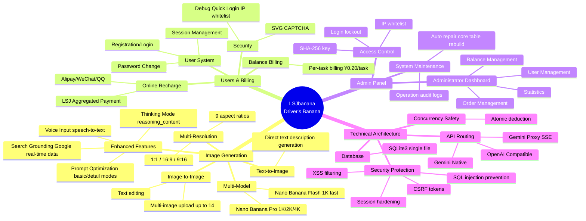

# LSJbanana

> **[中文文档](README.md)**

AI Image Generation and Management Platform based on Gemini 3 Pro Image (Nano Banana).

## Core Features



## Quick Start

```bash
# 1. Copy configuration file
cp config.php.example config.php

# 2. Edit config.php to fill in API keys and payment configuration

# 3. Start the server
php -S 127.0.0.1:8000

# 4. Access the application
# Frontend: http://127.0.0.1:8000
# Admin: http://127.0.0.1:8000/admin
```

## Core Configuration

Edit `config.php`, the system provides fine-grained feature control:

### API & Models
| Configuration | Description |
|---------------|-------------|
| `api_provider` | `native` (direct) / `openai_compatible` (relay) / `gemini_proxy` (SSE proxy) |
| `active_image_model` | `pro` (1K/2K/4K, search grounding) / `flash` (1K fast) |
| `thinking_config` | Thinking mode config, supports `reasoning_content` passthrough |
| `speech_to_text` | Speech-to-text config, defaults to `gemini-2.5-flash` |

### Payment & Users
| Configuration | Description |
|---------------|-------------|
| `payment.channels` | Payment channel switches (`alipay`/`wxpay`/`cashier`) |
| `billing.price_per_task` | Price per generation (RMB) |
| `user.lockout_duration` | Login failure lockout duration |
| `captcha.enable_*` | Login/registration CAPTCHA switches |
| `admin.key_hash` | Admin key hash (generate with `generate_admin_key.php`) |

## Debugging & Diagnostics

The system includes powerful debugging tools, **recommended for development environments only**.

### 1. Quick Login Tool
Bypass password verification for quick login to test accounts or admin panel.
```bash
# Generate admin quick login link
php generate_quick_login.php http://127.0.0.1:8080

# Generate test user quick login link
php generate_quick_login.php user http://127.0.0.1:8080
```
> Requires enabling `$adminConfig['debug_quick_login']` in `config.php`

### 2. System Diagnostic Interface
Check environment health, configuration, and database integrity.
```bash
# Generate signed diagnostic URL
php generate_quick_login.php diagnostic http://127.0.0.1:8080

# Access example (append action parameter)
# http://.../debug_diagnostic.php?...&action=status
```
Supported actions: `status` (status), `config` (configuration), `env` (environment), `db_health` (database check)

## Recommended Deployment Configuration

### PHP Configuration (php.ini)
```ini
max_execution_time = 300
memory_limit = 768M
post_max_size = 120M
upload_max_filesize = 10M
max_file_uploads = 20
# Required extensions
extension=curl
extension=openssl
extension=mbstring
extension=fileinfo
extension=pdo_sqlite
```

### Nginx Configuration
```nginx
location ~ \.php$ {
    fastcgi_pass unix:/tmp/php-cgi.sock;
    fastcgi_read_timeout 300;
    fastcgi_buffers 16 16k;
    fastcgi_buffer_size 32k;
}
```

## Tech Stack Details

- **Backend**: PHP 8.x
  - **Database**: SQLite3 (PDO mode, atomic transactions)
  - **Required Extensions**: `curl`, `openssl`, `mbstring`, `fileinfo`
- **Frontend**: Native JS (ES6+) + CSS3 (Responsive)
- **AI Capabilities**:
  - **Drawing**: Gemini 3 Pro Image (Nano Banana Pro)
  - **Optimization**: Gemini 2.5 Flash (Prompt Engineering)
  - **Speech**: Gemini 2.5 Flash (ASR)
- **Payment Integration**: [LSJ Easy Pay](https://github.com/RusianHu/LsjEpay) (MD5 signature)

## License

[Apache License 2.0](LICENSE)