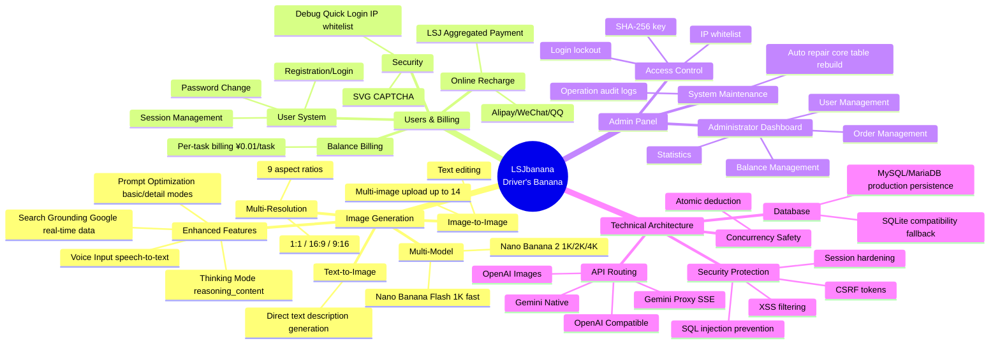

# LSJbanana

> **[中文文档](README.md)**

An image generation, editing, and management platform with switchable AI providers and models.

## Core Features


```mermaid
mindmap
  root((LSJbanana<br>Driver's Banana))
    Image Generation
      Text-to-Image
        Direct text description generation
      Image-to-Image
        Multi-image upload up to 14
        Text editing
      Multi-Model
        Nano Banana 2 1K/2K/4K
        Nano Banana Flash 1K fast
      Multi-Resolution
        9 aspect ratios
        1:1 / 16:9 / 9:16
      Enhanced Features
        Search Grounding Google real-time data
        Prompt Optimization basic/detail modes
        Voice Input speech-to-text
        Thinking Mode reasoning_content
    Users & Billing
      User System
        Registration/Login
        Session Management
        Password Change
      Balance Billing
        Per-task billing ¥0.01/task
      Online Recharge
        LSJ Aggregated Payment
        Alipay/WeChat/QQ
      Security
        SVG CAPTCHA
        Debug Quick Login IP whitelist
    Admin Panel
      Administrator Dashboard
        User Management
        Order Management
        Balance Management
        Statistics
      Access Control
        SHA-256 key
        IP whitelist
        Login lockout
      System Maintenance
        Operation audit logs
        Auto repair core table rebuild
    Technical Architecture
      Database
        MySQL/MariaDB production persistence
        SQLite compatibility fallback
      API Routing
        Gemini Native
        OpenAI Compatible
        OpenAI Images
        Gemini Proxy SSE
      Security Protection
        CSRF tokens
        SQL injection prevention
        XSS filtering
        Session hardening
      Concurrency Safety
        Atomic deduction
```

## Quick Start

### Portable MariaDB for Windows Development

```powershell
# 1. Download, verify, initialize, and start MariaDB on 127.0.0.1:3307
.\portable_mariadb.ps1 install

# 2. Run once when upgrading from an existing SQLite database; skip for a fresh install
.\php\php.exe .\migrate_sqlite_to_mysql.php

# 3. Start PHP
.\php\php.exe -S 127.0.0.1:8000
```

Common management commands:

```powershell
.\portable_mariadb.ps1 status
.\portable_mariadb.ps1 stop
.\portable_mariadb.ps1 start
```

The portable runtime lives in `database/.mariadb/`, while downloads are cached in `database/.mariadb-download/`; both are ignored by Git. The default passwords are for local development only and must never be reused on a VPS.

### Standard Deployment

```bash
# 1. Copy configuration file
cp config.php.example config.php

# 2. Create a MySQL database and least-privilege user, then edit database.mysql in config.php

# 3. When upgrading, back up the SQLite file and migrate its data
php migrate_sqlite_to_mysql.php

# 4. Fill in API/payment settings and start the server
php -S 127.0.0.1:8000

# 5. Access the application
# Frontend: http://127.0.0.1:8000
# Admin: http://127.0.0.1:8000/admin
```

The migration tool refuses to write to a non-empty target by default. Clearing the managed target tables and importing again requires the explicit `--force` flag. The SQLite source remains unchanged for rollback.

## Core Configuration

Edit `config.php`, the system provides fine-grained feature control:

### API & Models
| Configuration | Description |
|---------------|-------------|
| `api_provider` | `native` (direct) / `openai_compatible` (relay) / `gemini_proxy` (SSE proxy) |
| `image_api_provider` | Dedicated image route; may use `openai_images` without changing prompt-optimization/text calls |
| `openai_images` | OpenAI `/v1/images/generations` and `/v1/images/edits` settings; GPT Image 2 maps aspect ratio plus the 1K / 2K / 4K tier to an official `WIDTHxHEIGHT`; `verify_output_size` reports upstream size deviations, `reject_output_size_mismatch` enables strict rejection, and `force_ipv4` avoids long-lived connection resets on some IPv6 paths |
| `active_image_model` | `pro` / `flash` / `gpt_image_2`, selected by deployment configuration |
| `thinking_config` | Thinking mode config, supports `reasoning_content` passthrough |
| `speech_to_text` | Speech-to-text config, defaults to `gemini-2.5-flash` |

### Payment & Users
| Configuration | Description |
|---------------|-------------|
| `database.driver` | `mysql` (recommended for production) or `sqlite` (compatibility fallback) |
| `database.mysql` | Host, port, database, credentials, charset, and optional TLS settings |
| `payment.channels` | Payment channel switches (`alipay`/`wxpay`/`cashier`) |
| `billing.price_per_task` | Price per generation (RMB) |
| `user.lockout_duration` | Login failure lockout duration |
| `captcha.enable_*` | Login/registration CAPTCHA switches |
| `admin.key_hash` | Admin key hash (generate with `generate_admin_key.php`) |

## Debugging & Diagnostics

The system includes powerful debugging tools, **recommended for development environments only**.

### 1. Quick Login Tool
Bypass password verification for quick login to test accounts or admin panel.
```bash
# Generate admin quick login link
php generate_quick_login.php http://127.0.0.1:8080

# Generate test user quick login link
php generate_quick_login.php user http://127.0.0.1:8080
```
> Requires enabling `$adminConfig['debug_quick_login']` in `config.php`

### 2. System Diagnostic Interface
Check environment health, configuration, and database integrity.
```bash
# Generate signed diagnostic URL
php generate_quick_login.php diagnostic http://127.0.0.1:8080

# Access example (append action parameter)
# http://.../debug_diagnostic.php?...&action=status
```
Supported actions: `status` (status), `config` (configuration), `env` (environment), `db_health` (database check)

## Recommended Deployment Configuration

### PHP Configuration (php.ini)
```ini
max_execution_time = 300
memory_limit = 768M
post_max_size = 120M
upload_max_filesize = 10M
max_file_uploads = 20
# Required extensions
extension=curl
extension=openssl
extension=mbstring
extension=fileinfo
extension=pdo_mysql
# Required only for migration or SQLite fallback
extension=pdo_sqlite
```

### MySQL/MariaDB Security Recommendations

- When PHP and the database share a VPS, bind only to `127.0.0.1` or use a Unix socket; do not expose port 3306 publicly.
- Create a dedicated application account restricted to the `lsjbanana` database; never use `root`.
- Supply production credentials through environment variables or a permission-restricted `config.php`, and back up the database regularly.
- Enable `database.mysql.ssl` with certificate verification for cross-host connections.

### Nginx Configuration
```nginx
location ~ \.php$ {
    fastcgi_pass unix:/tmp/php-cgi.sock;
    fastcgi_read_timeout 300;
    fastcgi_buffers 16 16k;
    fastcgi_buffer_size 32k;
}
```

## Tech Stack Details

- **Backend**: PHP 8.x
  - **Database**: MySQL 8.0+ / MariaDB 10.6+ recommended, with legacy MySQL 5.5 and SQLite compatibility
  - **Required Extensions**: `curl`, `openssl`, `mbstring`, `fileinfo`, `pdo_mysql`
- **Frontend**: Native JS (ES6+) + CSS3 (Responsive)
- **AI Capabilities**:
  - **Drawing**: Gemini image models or the OpenAI Images API, including `gpt-image-2`
  - **Optimization**: Dynamically configured by `api_provider` and `prompt_optimize_model`
  - **Speech**: Dynamically configured by `speech_to_text`
- **Payment Integration**: [LSJ Easy Pay](https://github.com/RusianHu/LsjEpay) (MD5 signature)

## License

[Apache License 2.0](LICENSE)
