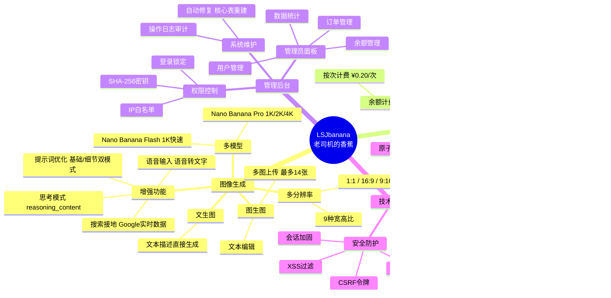

# LSJbanana

基于 Gemini 3 Pro Image (Nano Banana) 的 AI 图像生成与管理平台。

## 核心功能



## 快速开始

```bash
# 1. 复制配置文件
cp config.php.example config.php

# 2. 编辑 config.php 填写 API 密钥与支付配置

# 3. 启动服务
php -S 127.0.0.1:8000

# 4. 访问应用
# 前台: http://127.0.0.1:8000
# 后台: http://127.0.0.1:8000/admin
```

## 核心配置

编辑 `config.php`：

| 配置项 | 说明 |
|--------|------|
| `api_provider` | API 路由: `native` / `openai_compatible` / `gemini_proxy` |
| `api_key` | Gemini API 密钥 |
| `active_image_model` | 图像模型: `pro` (1K/2K/4K) / `flash` (1K 快速) |
| `payment.enabled` | 是否启用支付功能 |
| `billing.price_per_task` | 每次任务价格 (RMB) |
| `user.enable_registration` | 是否开放注册 |
| `admin.key_hash` | 管理员密钥 SHA-256 哈希 (见 `generate_admin_key.php`) |

## 推荐部署配置

### PHP 配置 (php.ini)
```ini
max_execution_time = 300
memory_limit = 768M
post_max_size = 120M
upload_max_filesize = 10M
max_file_uploads = 20
```

### PHP-FPM 配置
```ini
pm = dynamic
pm.max_children = 50
pm.max_requests = 500
```

### Nginx 配置
```nginx
location ~ \.php$ {
    fastcgi_pass unix:/tmp/php-cgi.sock;
    fastcgi_read_timeout 300;
    fastcgi_buffers 16 16k;
    fastcgi_buffer_size 32k;
}
```

## 技术栈

- **后端**：PHP 8.x + PDO (SQLite3)
- **前端**：原生 JavaScript + CSS3
- **API**：Google Gemini API / OpenAI 兼容接口
- **支付**：[老司机易支付](https://github.com/RusianHu/LsjEpay)

## 许可证

[Apache License 2.0](LICENSE)
