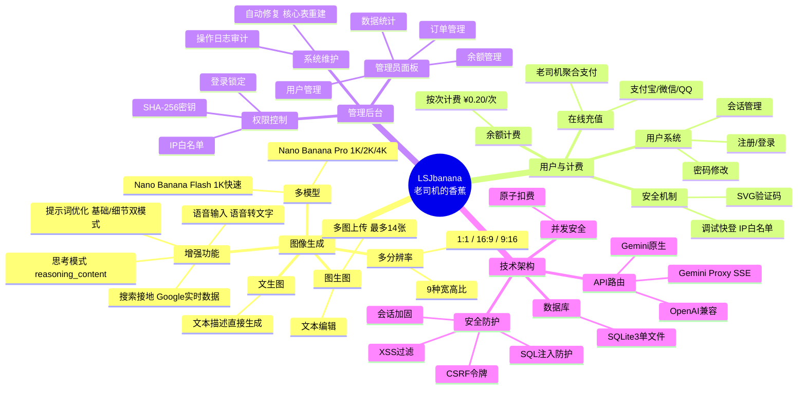

# LSJbanana

> **[English Documentation](README.EN.md)**

基于 Gemini 3 Pro Image (Nano Banana) 的 AI 图像生成与管理平台。

## 核心功能



## 快速开始

```bash
# 1. 复制配置文件
cp config.php.example config.php

# 2. 编辑 config.php 填写 API 密钥与支付配置

# 3. 启动服务
php -S 127.0.0.1:8000

# 4. 访问应用
# 前台: http://127.0.0.1:8000
# 后台: http://127.0.0.1:8000/admin
```

## 核心配置

编辑 `config.php`，系统提供精细化的功能控制：

### API 与模型
| 配置项 | 说明 |
|--------|------|
| `api_provider` | `native` (直连) / `openai_compatible` (中转) / `gemini_proxy` (SSE代理) |
| `active_image_model` | `pro` (1K/2K/4K, 搜索接地) / `flash` (1K 快速) |
| `thinking_config` | 思考模式配置，支持 `reasoning_content` 透传 |
| `speech_to_text` | 语音转文字配置，默认使用 `gemini-2.5-flash` |

### 支付与用户
| 配置项 | 说明 |
|--------|------|
| `payment.channels` | 支付渠道开关 (`alipay`/`wxpay`/`cashier`) |
| `billing.price_per_task` | 单次生成价格 (RMB) |
| `user.lockout_duration` | 登录失败锁定时间 |
| `captcha.enable_*` | 登录/注册验证码开关 |
| `admin.key_hash` | 管理员密钥哈希 (使用 `generate_admin_key.php` 生成) |

## 调试与诊断

系统内置了强大的调试工具，**仅建议在开发环境下启用**。

### 1. 快速登录工具
绕过密码验证快速登录测试账户或管理员后台。
```bash
# 生成管理员快速登录链接
php generate_quick_login.php http://127.0.0.1:8080

# 生成测试用户快速登录链接
php generate_quick_login.php user http://127.0.0.1:8080
```
> 需在 `config.php` 中开启 `$adminConfig['debug_quick_login']`

### 2. 系统诊断接口
检查环境健康状态、配置及数据库完整性。
```bash
# 生成带签名的诊断 URL
php generate_quick_login.php diagnostic http://127.0.0.1:8080

# 访问示例 (需追加 action 参数)
# http://.../debug_diagnostic.php?...&action=status
```
支持动作：`status` (状态), `config` (配置), `env` (环境), `db_health` (数据库检查)

## 推荐部署配置

### PHP 配置 (php.ini)
```ini
max_execution_time = 300
memory_limit = 768M
post_max_size = 120M
upload_max_filesize = 10M
max_file_uploads = 20
# 必需扩展
extension=curl
extension=openssl
extension=mbstring
extension=fileinfo
extension=pdo_sqlite
```

### Nginx 配置
```nginx
location ~ \.php$ {
    fastcgi_pass unix:/tmp/php-cgi.sock;
    fastcgi_read_timeout 300;
    fastcgi_buffers 16 16k;
    fastcgi_buffer_size 32k;
}
```

## 技术栈细节

- **后端**：PHP 8.x
  - **数据库**：SQLite3 (PDO模式, 原子事务)
  - **必需扩展**：`curl`, `openssl`, `mbstring`, `fileinfo`
- **前端**：Native JS (ES6+) + CSS3 (Responsive)
- **AI 能力**：
  - **绘图**：Gemini 3 Pro Image (Nano Banana Pro)
  - **优化**：Gemini 2.5 Flash (Prompt Engineering)
  - **语音**：Gemini 2.5 Flash (ASR)
- **支付集成**：[老司机易支付](https://github.com/RusianHu/LsjEpay) (MD5签名)

## 许可证

[Apache License 2.0](LICENSE)
