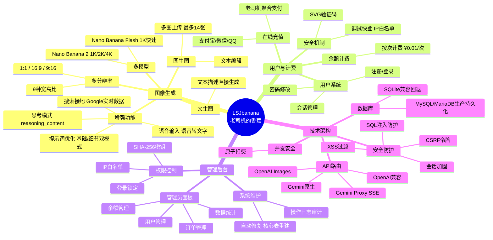

# LSJbanana

> **[English Documentation](README.EN.md)**

支持可切换 AI 图片渠道与模型的图像生成、编辑及管理平台。

## 核心功能


```mermaid
mindmap
  root((LSJbanana<br>老司机的香蕉))
    图像生成
      文生图
        文本描述直接生成
      图生图
        多图上传 最多14张
        文本编辑
      多模型
        Nano Banana 2 1K/2K/4K
        Nano Banana Flash 1K快速
      多分辨率
        9种宽高比
        1:1 / 16:9 / 9:16
      增强功能
        搜索接地 Google实时数据
        提示词优化 基础/细节双模式
        语音输入 语音转文字
        思考模式 reasoning_content
    用户与计费
      用户系统
        注册/登录
        会话管理
        密码修改
      余额计费
        按次计费 ¥0.01/次
      在线充值
        老司机聚合支付
        支付宝/微信/QQ
      安全机制
        SVG验证码
        调试快登 IP白名单
    管理后台
      管理员面板
        用户管理
        订单管理
        余额管理
        数据统计
      权限控制
        SHA-256密钥
        IP白名单
        登录锁定
      系统维护
        操作日志审计
        自动修复 核心表重建
    技术架构
      数据库
        MySQL/MariaDB生产持久化
        SQLite兼容回退
      API路由
        Gemini原生
        OpenAI兼容
        OpenAI Images
        Gemini Proxy SSE
      安全防护
        CSRF令牌
        SQL注入防护
        XSS过滤
        会话加固
      并发安全
        原子扣费
```

## 快速开始

### Windows 便携式 MariaDB 调试

```powershell
# 1. 下载、校验、初始化并启动仅监听 127.0.0.1:3307 的 MariaDB
.\portable_mariadb.ps1 install

# 2. 已有 SQLite 数据时执行一次迁移；新项目可跳过
.\php\php.exe .\migrate_sqlite_to_mysql.php

# 3. 启动 PHP
.\php\php.exe -S 127.0.0.1:8000
```

常用管理命令：

```powershell
.\portable_mariadb.ps1 status
.\portable_mariadb.ps1 stop
.\portable_mariadb.ps1 start
```

便携运行时位于 `database/.mariadb/`，下载缓存位于 `database/.mariadb-download/`，均不会提交到 Git。默认口令仅用于本机调试，不可用于 VPS。

### 常规部署

```bash
# 1. 复制配置文件
cp config.php.example config.php

# 2. 创建 MySQL 数据库和最小权限用户，编辑 config.php 的 database.mysql

# 3. 从旧版升级时先备份 SQLite 文件，再迁移数据
php migrate_sqlite_to_mysql.php

# 4. 填写 API 密钥与支付配置并启动服务
php -S 127.0.0.1:8000

# 5. 访问应用
# 前台: http://127.0.0.1:8000
# 后台: http://127.0.0.1:8000/admin
```

迁移器默认只允许写入空目标库；如需清空项目管理的目标表后重迁，必须显式添加 `--force`。SQLite 源文件保持只读，便于随时回退。

## 核心配置

编辑 `config.php`，系统提供精细化的功能控制：

### API 与模型
| 配置项 | 说明 |
|--------|------|
| `api_provider` | `native` (直连) / `openai_compatible` (中转) / `gemini_proxy` (SSE代理) |
| `image_api_provider` | 独立图片渠道；可设置为 `openai_images`，不影响提示词优化等文本调用 |
| `openai_images` | OpenAI `/v1/images/generations` 与 `/v1/images/edits` 配置，支持 URL 型编辑输入 |
| `active_image_model` | `pro` / `flash` / `gpt_image_2`，由部署配置选择 |
| `thinking_config` | 思考模式配置，支持 `reasoning_content` 透传 |
| `speech_to_text` | 语音转文字配置，默认使用 `gemini-2.5-flash` |

### 支付与用户
| 配置项 | 说明 |
|--------|------|
| `database.driver` | `mysql`（生产推荐）或 `sqlite`（兼容回退） |
| `database.mysql` | 主机、端口、库名、用户名、密码、字符集及可选 TLS 配置 |
| `payment.channels` | 支付渠道开关 (`alipay`/`wxpay`/`cashier`) |
| `billing.price_per_task` | 单次生成价格 (RMB) |
| `user.lockout_duration` | 登录失败锁定时间 |
| `captcha.enable_*` | 登录/注册验证码开关 |
| `admin.key_hash` | 管理员密钥哈希 (使用 `generate_admin_key.php` 生成) |

## 调试与诊断

系统内置了强大的调试工具，**仅建议在开发环境下启用**。

### 1. 快速登录工具
绕过密码验证快速登录测试账户或管理员后台。
```bash
# 生成管理员快速登录链接
php generate_quick_login.php http://127.0.0.1:8080

# 生成测试用户快速登录链接
php generate_quick_login.php user http://127.0.0.1:8080
```
> 需在 `config.php` 中开启 `$adminConfig['debug_quick_login']`

### 2. 系统诊断接口
检查环境健康状态、配置及数据库完整性。
```bash
# 生成带签名的诊断 URL
php generate_quick_login.php diagnostic http://127.0.0.1:8080

# 访问示例 (需追加 action 参数)
# http://.../debug_diagnostic.php?...&action=status
```
支持动作：`status` (状态), `config` (配置), `env` (环境), `db_health` (数据库检查)

## 推荐部署配置

### PHP 配置 (php.ini)
```ini
max_execution_time = 300
memory_limit = 768M
post_max_size = 120M
upload_max_filesize = 10M
max_file_uploads = 20
# 必需扩展
extension=curl
extension=openssl
extension=mbstring
extension=fileinfo
extension=pdo_mysql
# 仅在迁移或 SQLite 回退时需要
extension=pdo_sqlite
```

### MySQL/MariaDB 安全建议

- 数据库与 PHP 位于同一台 VPS 时，仅监听 `127.0.0.1` 或使用 Unix socket，不开放公网 3306。
- 为应用创建仅限 `lsjbanana` 数据库的独立账号，不使用 `root`。
- 生产密码通过环境变量或受限权限的 `config.php` 提供，并定期备份数据库。
- 跨主机连接时开启 `database.mysql.ssl` 并校验证书。

### Nginx 配置
```nginx
location ~ \.php$ {
    fastcgi_pass unix:/tmp/php-cgi.sock;
    fastcgi_read_timeout 300;
    fastcgi_buffers 16 16k;
    fastcgi_buffer_size 32k;
}
```

## 技术栈细节

- **后端**：PHP 8.x
  - **数据库**：MySQL 8.0+ / MariaDB 10.6+ 推荐，兼容旧版 MySQL 5.5 与 SQLite
  - **必需扩展**：`curl`, `openssl`, `mbstring`, `fileinfo`, `pdo_mysql`
- **前端**：Native JS (ES6+) + CSS3 (Responsive)
- **AI 能力**：
  - **绘图**：Gemini 图片模型或 OpenAI Images API（包括 `gpt-image-2`）
  - **优化**：由 `api_provider` 与 `prompt_optimize_model` 动态配置
  - **语音**：由 `speech_to_text` 动态配置
- **支付集成**：[老司机易支付](https://github.com/RusianHu/LsjEpay) (MD5签名)

## 许可证

[Apache License 2.0](LICENSE)

